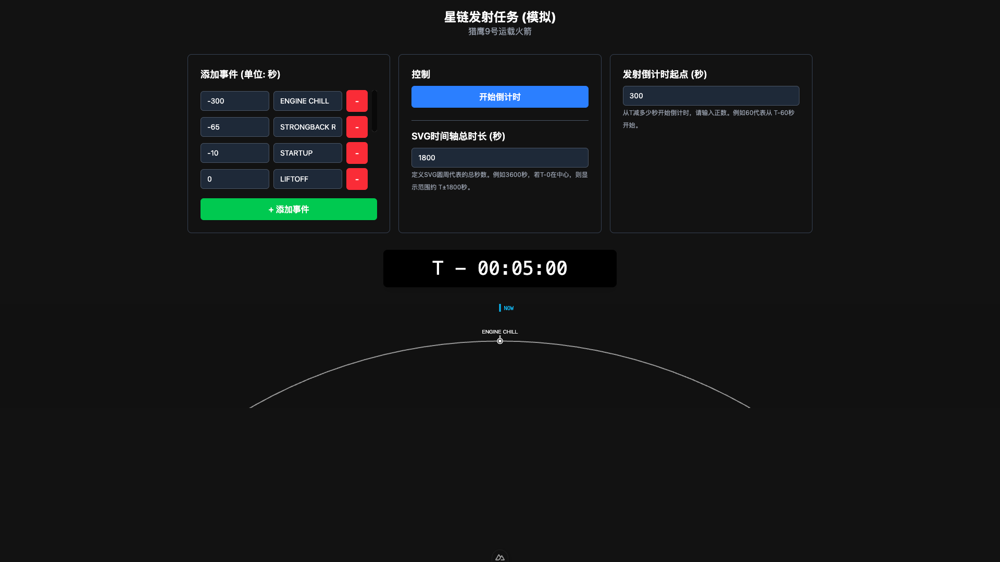

# SpaceX 发射时间线 UI (SpaceX Launch Timeline UI)

一个基于 Nuxt 3 和 Vue 3 构建的交互式 SpaceX 发射时间线模拟用户界面。用户可以自定义发射事件、总任务时长、倒计时起点，并通过一个动态的SVG圆弧时间线可视化整个发射过程。



## ✨ 项目特色

- **动态SVG时间线**: 事件节点在SVG圆弧上平滑移动，实时反映发射倒计时和任务进展。
- **可自定义事件**: 用户可以添加、删除和编辑时间线上的事件节点（名称和发生时间）。
- **灵活的时间控制**:
  - 自定义倒计时起点 (T- 多少秒开始)。
  - 自定义SVG圆弧代表的总时间跨度。
- **默认配置**: 包含一个模拟的星链发射任务作为默认事件集。
- **本地存储**: 用户对事件列表的修改会自动保存在浏览器的 localStorage 中，下次访问时恢复。
- **现代技术栈**: 使用 Nuxt 3、Vue 3、TypeScript 和 UnoCSS 构建。
- **简约设计**: 专注于核心功能，采用深色主题，UI元素简洁。
- **中文界面**: 所有UI文本均为中文。

## 🛠️ 技术栈

- **核心框架**: [Nuxt 3](https://nuxt.com/) (v3.11.2 或更高版本，根据你实际版本填写)
- **视图层**: [Vue 3](https://vuejs.org/) (Composition API)
- **语言**: [TypeScript](https://www.typescriptlang.org/)
- **样式方案**: [UnoCSS](https://unocss.dev/) (原子化 CSS 引擎)
- **构建工具**: Vite (Nuxt 3 内置)
- **状态管理**: Vue 3 Reactivity API (通过 `ref`, `computed` 等，在 `useSpaceTimeline` Composable 中实现)
- **代码规范**: ESLint (配置了 `eslint-plugin-unicorn`)

## 🚀 项目设置与运行

### 先决条件

- [Node.js](https://nodejs.org/) (建议使用 LTS 版本，例如 v18.x 或 v20.x)
- [pnpm](https://pnpm.io/installation) (推荐) 或 npm / yarn

### 安装依赖

```bash
# 使用 pnpm (推荐)
pnpm install

# 或者使用 npm
npm install

# 或者使用 yarn
yarn install
```

### 开发模式 (热重载)

启动开发服务器，通常在 `http://localhost:3000`：

```bash
# 使用 pnpm
pnpm dev

# 或者使用 npm
npm run dev

# 或者使用 yarn
yarn dev
```

### 构建生产版本

将应用构建为静态站点或用于服务器部署：

```bash
# 使用 pnpm
pnpm build

# 或者使用 npm
npm run build

# 或者使用 yarn
yarn build
```

### 预览生产版本 (构建后)

```bash
# 使用 pnpm
pnpm preview

# 或者使用 npm
npm run preview

# 或者使用 yarn
yarn preview
```

## ⚙️ 项目结构与关键组件

- **`pages/index.vue`**: 主页面，包含用户输入表单、控制按钮和时间显示。它调用 `useSpaceTimeline` Composable 来获取和管理状态。
- **`components/TimelineSvg.vue`**: 核心的SVG时间线可视化组件。它接收事件数据、总时长和当前时间偏移，并动态绘制节点。
- **`composables/useSpaceTimeline.ts`**: 主要的状态管理和逻辑处理单元。
  - 管理事件时间戳 (`timestamps`)、事件名称 (`nodeNames`)。
  - 处理用户输入的总任务时长 (`missionTimeRaw`) 和倒计时起点 (`timeValueRaw`)。
  - 控制倒计时开始/停止 (`toggleLaunch`)。
  - 计算并提供 `timerClock` (文本时钟显示) 和 `currentTimeOffset` (用于SVG平滑动画的精确时间)。
  - 使用 `requestAnimationFrame` 实现平滑的时间流逝效果。
  - 与 localStorage 交互以持久化用户数据。
- **`app.vue`**: Nuxt 应用的根组件，通常用于全局布局或配置。
- **`nuxt.config.ts`**: Nuxt 项目的配置文件，用于配置模块 (如 UnoCSS)、插件等。
- **`eslint.config.mjs`** (或 `.eslintrc.js`): ESLint 配置文件。

## 💡 代码设计说明

- **时间单位**: 项目内部所有时间处理均以 **秒** 为单位。用户输入的时间戳、总任务时长、倒计时起点都应为秒。
- **默认配置**: 项目启动时会加载 `composables/useSpaceTimeline.ts` 中定义的 `defaultConfig`，包含一组预设的发射事件。
- **SVG 动画**:
  - `currentTimeOffset` 是驱动SVG动画的核心。它是一个精确的浮点数，表示当前时间相对于 T-0 的偏移秒数（T- 阶段为负，T+ 阶段为正）。
  - `TimelineSvg.vue` 组件监听 `currentTimeOffset` 的变化，通过 `requestAnimationFrame` 在 `useSpaceTimeline.ts` 中平滑更新，从而实现节点的平滑移动。
  - 事件节点在SVG上的位置是根据其 `(固定事件时间 - currentTimeOffset)` 计算得出的。
- **响应式设计**: 当前项目 **未考虑响应式开发**，默认针对 `1920 * 1080` 屏幕尺寸。

## 🔧 自定义与配置

- **默认事件**: 修改 `composables/useSpaceTimeline.ts` 文件中的 `defaultConfig.events` 数组可以更改项目启动时的默认事件列表。
- **SVG 外观**:
  - 节点样式 (颜色、大小、形状) 在 `components/TimelineSvg.vue` 的 `plotNodesOnCircle` 函数中定义。
  - SVG圆弧的曲率、大小等可以通过调整 `components/TimelineSvg.vue` 中的 `circleRadius`、`circleCenterY` 等计算属性来修改。
  - SVG的总宽度和高度可以在 `pages/index.vue` 中传递给 `<TimelineSvg>` 组件的 `svg-width` 和 `svg-height` props。
- **样式**: UnoCSS 用于样式定义。可以直接在组件的 `<template>` 中使用原子化类名，或在 `<style scoped>` 块中通过 `@apply` 指令组合。

## 🔮 未来可能的增强

- **视频同步**: 集成 `defaultConfig.videoConfig` 中的视频源，并使其播放与时间线同步。
- **响应式设计**: 适配不同屏幕尺寸。
- **时间轴缩放/平移**: 允许用户交互式地缩放或平移SVG时间线，以查看更长或更短的时间范围。
- **更高级的节点自定义**: 允许用户为每个节点设置不同的图标或颜色。
- **导入/导出配置**: 允许用户导入或导出他们的自定义事件配置。
- **多语言支持**: 虽然当前是中文，但可以扩展为支持多种语言。
- **单元测试与端到端测试**: 增加测试以确保代码质量和功能稳定性。

## 🙏 致谢与灵感

参考了 [SpaceX Launch Timeline](https://github.com/yuchenliu15/spaceX-timeline)
此项目是为了试验 Nuxt 3 / Vue 3 并围绕一个有趣的小交互概念而创建的。灵感可能来源于真实的SpaceX发射界面或其他类似的时间线可视化工具。

---

欢迎贡献、提出问题或建议！
