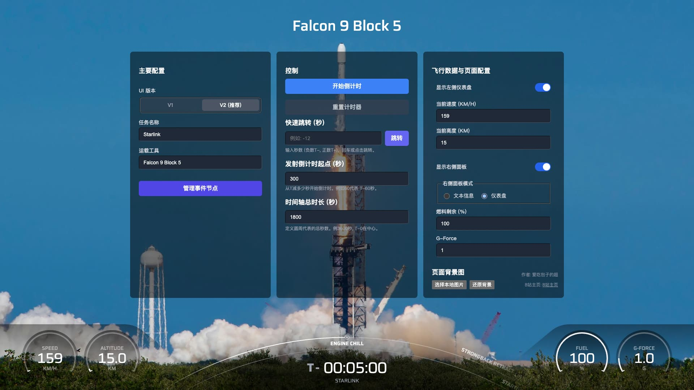

# SpaceX 发射时间线 UI (SpaceX Launch Timeline UI)

一个基于 Nuxt 3 和 Vue 3 构建的高度可定制、交互式的 SpaceX 发射时间线模拟器。用户可以自定义发射事件、时间控制，并可在两种截然不同的视觉风格（V1/V2）之间切换，以获得独特的视觉体验。



## ✨ 项目特色

- **双 UI 版本 (Dual UI Versions)**: 内置两种视觉与技术实现迥异的 UI 界面 (传统 V1 / 现代 V2)，可在控制面板中一键切换，默认使用 V2 版本。
- **动态 SVG 时间线**: 事件节点在 SVG 圆弧上平滑移动，实时反映发射倒计时和任务进展。
- **高级 V2 视觉效果**:
  - 采用 SVG `<mask>` 技术实现过去/未来时间轴的平滑颜色过渡。
  - 节点在接近 "现在" 时，其分布密度会动态变化，产生视觉上的拉伸/压缩效果。
  - 更精致的仪表盘和UI元素设计。
- **高度可定制**:
  - **事件管理**: 在模态框中轻松添加、删除和编辑时间线上的事件节点（名称和发生时间）。
  - **时间控制**: 自定义倒计时起点 (T- 多少秒开始) 和 SVG 圆弧代表的总时间跨度。
  - **飞行数据**: 实时修改速度、高度、燃料、G-Force 等遥测数据。
  - **界面显隐**: 自由控制左右侧仪表盘的显示/隐藏，并可切换右侧面板为“遥测数据”或“文本信息”模式。
- **持久化存储**: 所有用户配置（包括选择的UI版本、事件列表、遥测数据等）都会自动保存在浏览器的 `localStorage` 中，下次访问时无缝恢复。
- **现代技术栈**: 使用 Nuxt 3 (SPA 模式)、Vue 3 (Composition API)、TypeScript 和 UnoCSS 构建，代码风格严格遵循 `@antfu/eslint-config`。
- **固定比例布局**: 针对 `1920x1080` 分辨率设计，通过 CSS `transform: scale()` 自动缩放以适应不同屏幕大小，保证视觉效果一致性。

## 🎨 UI 版本对比

您可以在 **主要配置 -> UI 版本** 中切换两种风格：

| 特性         | Falcon9V1 (传统版)                         | Falcon9V2 (现代版 - 默认)                                                      |
| :----------- | :----------------------------------------- | :----------------------------------------------------------------------------- |
| **技术实现** | 直接在组件内进行 DOM 操作和计算。          | 逻辑拆分到 Composables (`useTimelineGeometry`, `useTimelineNodes`)，更模块化。 |
| **视觉效果** | 节点均匀分布，通过改变密度因子来调整间距。 | 采用 SVG Mask 实现平滑颜色过渡，节点分布动态变化，视觉效果更丰富。             |
| **动画**     | 节点密度在特定时间点进行平滑插值过渡。     | 节点位置、颜色、密度均有平滑的缓动动画，过渡更自然。                           |
| **仪表盘**   | 设计较为复古，有红/白两段式进度。          | 设计更简洁、现代化，单色进度条，视觉信息更清晰。                               |

## 🛠️ 技术栈

- **核心框架**: [Nuxt 3](https://nuxt.com/) (v3.17.4)
- **视图层**: [Vue 3](https://vuejs.org/) (Composition API, `defineModel`)
- **语言**: [TypeScript](https://www.typescriptlang.org/)
- **样式方案**: [UnoCSS](https://unocss.dev/) (原子化 CSS 引擎)
- **状态管理**: Vue 3 Reactivity API + `@vueuse/core` (`useLocalStorage`)，逻辑集中在 `useSpaceTimeline` Composable 中。
- **代码规范**: ESLint (基于 `@antfu/eslint-config`)
- **部署**: 已配置用于 Netlify 和 Docker。

## 🚀 项目设置与运行

### 先决条件

- [Node.js](https://nodejs.org/) (v20.x)
- [pnpm](https://pnpm.io/installation) (v10.x 或更高版本)

### 安装依赖

```bash
pnpm install
```

### 开发模式 (热重载)

启动开发服务器，将在 `http://localhost:3001` 上可用：

```bash
pnpm dev
```

### 构建生产版本

将应用构建为用于部署的静态文件 (SPA)：

```bash
pnpm build
```

### 预览生产版本 (构建后)

```bash
pnpm preview
```

## ⚙️ 核心架构与代码设计

- **`composables/useSpaceTimeline.ts`**: **项目的大脑**。这个 Composable 是所有响应式状态的唯一来源 (Single Source of Truth)。它管理着计时器逻辑、所有用户配置（包括新增的 `timelineVersion`）、事件数据以及与 `localStorage` 的交互。

- **`pages/index.vue`**: **主舞台**。它负责调用 `useSpaceTimeline`，获取所有状态和方法，并将它们通过 `v-model` (利用 `defineModel`) 和 props 传递给各个UI组件。它还根据 `timelineVersion` 的值，条件渲染 V1 或 V2 版本的组件。

- **`components/ControlPanel.vue`**: **中央控制器**。一个功能丰富的面板，允许用户修改几乎所有可配置项。它大量使用了 `defineModel` 来简化与父组件的双向数据绑定。

- **`components/Falcon9V2/`**: **V2 版本的核心实现（推荐学习）**。

  - **`TimelineSvg.vue`**: 视图层，负责渲染 SVG 元素。它自身几乎没有复杂逻辑。
  - **`composables/useTimelineGeometry.ts`**: 纯计算 Composable，负责处理所有与 SVG 几何相关的计算（如圆心、半径）。
  - **`composables/useTimelineNodes.ts`**: 核心动态计算 Composable。它接收几何数据和时间数据，计算出每个节点的精确位置、颜色、文本旋转、可见性等所有动态属性。
  - **`utils/`**: 包含绘图 (`svgDrawing.ts`) 和颜色处理 (`color.ts`) 的辅助函数，进一步提升了代码的模块化和可读性。

- **`components/layout/Adapter.vue`**: **布局适配器**。通过计算浏览器视口与设计稿（1920x1080）的宽高比，使用 CSS `transform: scale()` 来缩放整个应用，确保在任何屏幕上都保持原始设计比例。

## 部署

项目已为两种常见的部署方式做好了准备：

1.  **Netlify**: 根目录下的 `netlify.toml` 文件已配置好。它指定了构建命令和正确的重定向规则（`/* -> /index.html 200`），非常适合部署 Nuxt 3 的 SPA 应用。
2.  **Docker**: 根目录下的 `Dockerfile` 采用多阶段构建，生成一个轻量级的生产镜像，可用于任何支持 Docker 的云平台或服务器。

## 🙏 致谢与灵感

本项目的设计灵感来源于真实的 SpaceX 发射界面，并参考了 [SpaceX Launch Timeline by yuchenliu15](https://github.com/yuchenliu15/spaceX-timeline)。

此项目是作为 Nuxt 3 / Vue 3 的一个实践案例而创建的，旨在探索现代前端技术栈在一个有趣、交互性强的场景下的应用。

---

欢迎贡献、提出问题或建议！
